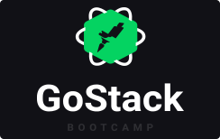

  

  
  <h3 align="center">Repositório com todos os módulos, aulas e desafios do bootcamp Gostack da Rockeseat :rocket::purple_heart:</h3>

  

<h4>Nova Jornada</h4>

| Nível | Título                                                                                      |                                                Descrição                                                 |  Tecnologia  |
| ----- | :------------------------------------------------------------------------------------------ | :------------------------------------------------------------------------------------------------------: | :----------: |
| 01    | Desafio: [Conceitos NodeJS](https://github.com/walefe/gostack-conceitos-nodejs)             | Esse desafio contém conceitos básicos de API Rest com NodeJS construídos utilizando o framework Express. |    NodeJS    |
| 01    | Desafio: [Conceitos ReactJS](https://github.com/walefe/gostack-conceitos-reactjs)           |                           Esse desafio contém conceitos básicos sobre ReactJS.                           |   ReactJS    |
| 01    | Desafio: [Conceitos React-Native](https://github.com/walefe/gostack-conceitos-react-native) |                        Esse desafio contém conceitos básicos sobre React-Native.                         | React-Native |
| 02    | Desafio: [Fundamentos NodeJS](https://github.com/walefe/gostack-template-fundamentos-node) |                        Fundamentos básicos do NodeJS.                         | NodeJS |
| 02    | Desafio: [Database upload](https://github.com/walefe/gostack-template-typeorm-upload) |                        API para gestão de transações utilizando Typescript e TypeORM.                         | NodeJS |
| 03    | Desafio: [Fundamentos ReactJS](https://github.com/walefe/gostack-template-fundamentos-reactjs) |                    Interface da aplicação de gestão de transações GoFinances.                         | ReactJS |
| 03    | Desafio: [Fundamentos React-Native](https://github.com/walefe/gostack-template-fundamentos-react-native) |         Aplicativo mobile GoMarketplace.                         | React-Native |
